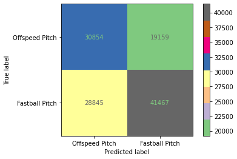
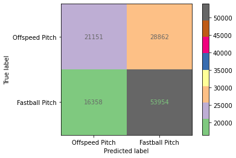

# Predicting the Next Pitch: Utilizing Machine Learning to Predict the Next Pitch Thrown

## [Presentation](https://docs.google.com/presentation/d/1y4YjQAgXK8ih6pTRteLluqH_tNTX0nqILFNmsQQ99ls/edit?usp=sharing)

## Problem Statement

MLB scouting departments have become heavily reliant on data analysis since the advent of Moneyball. With the added data being provided by Statcast - a high-speed, high-accuracy, automated tool developed to analyze player movements and athletic abilities in Major League Baseball - teams are now looking to get that extra edge from Machine Learning. The goal of this project is to utilize statcast data and machine learning algorithms from the 2018 MLB season to predict a pitcher's next pitch based on the pitcher's repertoire and the situational context under which the pitch is being thrown. Furthermore, this predictive modeling could be used to identify undervalued players as potential trade targets for the upcoming 2021 season. 

## Background
The 2017 Astros will always have an asterisk next to their World Series title due to a cheating scandal that occurred throught the regular and postseason. Their scheme involved have a well-placed camera zoomed in on the catcher's hand as he relayed the type of pitch he wanted the pitcher to throw next. A live-stream of this camera was placed in the dugout where a technician would bang a trash can to indicate whether a fastball or off-speed pitch was coming next. 

While I am not necessarily motivated by the Astros scoundrelous ways, this scandal did inspire me to explore whether there is a better way to prepare hitters for certain situations against certain types of pitchers. Furthermore, I became curious if one could become even more granular with their predictions and determine whether a fastball, off-speed (change-up), or breaking ball (slider, curveball) is coming next. 

One thing that became apparent quickly: predicting pitches is quite difficult. Pitchers are intentionally random to throw off the hitters timing and gain the upperhand. However, patterns did emerge in certain situations that might be helpful to hitters in their preparation. As one of the all-time greats Hank Aaron once said: **“Guessing what the pitcher is going to throw is 80 percent of being a successful hitter. The other 20 percent is just execution.”**

## Executive Summary

### Goal
The goal of this study is to predict the next pitch based on the pitcher's repertoire, hitter's previous season batting average, and the situational context under which the pitch is being thrown. 

### Data Collection
I downloaded data from Baseball Savant's Statcast website utilizing the baseball_scraper python package. 

### Data Description
As described above, I am hoping to use the situation of the game to predict the next pitch. Situational data is included in the statcast data originally includes the count when the pitch is thrown, if there are runners on base, handedness of pitcher and batter, and the score of the game.

To capture situational data without leaking information to the model, I looked at the information from the previous pitch thrown to the batter. This led to my next topic which is 

#### Feature Engineering
To not leak data to the model, I needed to gather data from the previous pitch as a feature for the prediction in the current pitch. I collected the number of each pitch thrown to the batter up to that point, I specified the previous pitch as its own feature. In addition I tried to capture the result of the previous at-bat using weighted-on-base average (which calculates a score of the previous at-bat based on the event that occurred), but I noticed inconsistencies in the data that caused me to throw out that feature.

In addition to pre-pitch data, I wanted to take into account historical information about both the hitter and the pitcher. In doing so, I created features that measured the proportion of breaking balls thrown by the pitcher in 2018, proportion of fastballs thrown by the pitcher in 2018, the hitters weighted on-base average in 2018, and the hitter's average lauch speed in 2018. 

### Modeling
I primarily used three classification algorithms: Logistic Regression, Random Forest, and K-Nearest Neighbors. The logistic and random forest algorithms ended up being the most effective in terms of accuracy, precision, and recall. 

# Recommendations and Conclusions

## Would not Rely on Multiclass Model

1. All of the models are within error of the baseline and do not accurately predict the changeup. Therefore, I would recommend investing more in the models predicting binary "offspeed" or "fastball" initially before investing more heavily into the multiclass models.   

2. The Houston Astros cheating scandal only relayed whether the next pitch was going to be a fastball or offspeed pitch. Therefore, there is a clear advantage gained from even having that level of distinction for the hitter. 

## Best Models for Various Scenarios

**Binary labels**
1. Pitcher throws more offspeed and/ or might not have overpowering fastball
    * For this scenario I would recommend my logistic regression model that is dummied and grid searches for the weighted F1 metric. This model reduces the false positives caused by over-predicting fastballs. However, as a result, it also has more false negatives (offspeed label when should have been fastball label). Therefore, this model would be more useful against a pitcher who relies on his fastball less. 

**Figure 1: Logistic regression optimized for the F-1 score had the most baanced predictions. It limited the number of false positives (falsely predicting fastball) the most.**
    
    
2. Pitcher that Relies Heavily on Fastballs
    * The random forest model has the highest accuracy and a higher F1 score than the logistic regression with the next nearest accuracy. Therefore, I would recommend the random forest model to best describe the scenario where the pitcher throws a high proportion of fastballs. 

**Figure 2: My Random Forest models performed the best for piters who frequently throw fastballs. While it has more false positives than the previous figure, it has the highest accuracy and limits the number of false positives compared to the logistic regression with the highest accuracy**

## Next Steps and Future Work

In the future, I hope to capture more granular trends when predicting a pitch. 
* Need to account for how pitcher last pitched against the team he is currently facing.
    * Divisional opponents play each other frequently and therefore the pitcher has to mix up the pitches he throws to batters in consecutive outings. 
    * Specific data about how the batter hit against certain pitches in the pitcher's arsenal the last time they played.
* Create team models, or get even more granular and build models for specific pitchers. 
    * Use these models as the basis for transfer learning or just have useful models for frequently faced pitchers (divisional opponents)
* Create many small models to predict a pitch in certain situations (for example, build model specific to 2 strike count with runners in scoring position)
* Account for pitcher hot streaks
    * Pitcher mentality is a huge facet of their confidence in throwing certain pitches. Therefore, if a pitcher has been accurate and performing well over the previous few games, he will have the confidence to mix up his pitch sequences more. 
* Account for catcher calling pitches
    * Certain catchers might have tendencies for calling for certain pitches in a specific situation. Maybe can pick up a signal on catcher influence
* Account for weather
    * Having a solid grip on the ball is incredibly important when deciding which pitch to throw. Therefore, need to account for weather conditions and possibly even stadium influences (is it a pitcher's park) that would help generate more signal in my data. 

### Modified DataFrame Data Dictionary

### Original Data Dictionary
| pitch_type                      | Type of pitch thrown                                                                                                                                                              |
|---------------------------------|-----------------------------------------------------------------------------------------------------------------------------------------------------------------------------------|
| game_date                       | Date of Game                                                                                                                                                                      |
| release_speed                   | Release speed of pitch out of pitcher's hand                                                                                                                                      |
| release_pos_x                   | Horizontal Release Position of the ball measured in feet from the catcher's perspective.                                                                                          |
| release_pos_z                   | Vertical Release Position of the ball measured in feet from the catcher's perspective.                                                                                            |
| player_name                     | Player's name tied to the event of the search.                                                                                                                                    |
| batter                          | Batter MLB Player Id tied to the play event.                                                                                                                                      |
| pitcher                         | Pitcher MLB Player Id tied to the play event.                                                                                                                                     |
| events                          | Event of the resulting Plate Appearance.                                                                                                                                          |
| description                     | Description of the resulting pitch.                                                                                                                                               |
| zone                            | Zone location of the ball when it crosses the plate from the catcher's perspective.                                                                                               |
| des                             | Plate appearance description from game day.                                                                                                                                       |
| game_type                       | Type of Game. E = Exhibition, S = Spring Training, R = Regular Season, F = Wild Card, D = Divisional Series, L = League Championship Series, W = World Series                     |
| stand                           | Side of the plate batter is standing.                                                                                                                                             |
| p_throws                        | Hand pitcher throws with.                                                                                                                                                         |
| home_team                       | Abbreviation of home team.                                                                                                                                                        |
| away_team                       | Abbreviation of away team.                                                                                                                                                        |
| type                            | Short hand of pitch result. B = ball, S = strike, X = in play.                                                                                                                    |
| hit_location                    | Position of first fielder to touch the ball.                                                                                                                                      |
| bb_type                         | Batted ball type, ground_ball, line_drive, fly_ball, popup.                                                                                                                       |
| balls                           | Pre-pitch number of balls in count.                                                                                                                                               |
| strikes                         | Pre-pitch number of strikes in count.                                                                                                                                             |
| game_year                       | Year game took place.                                                                                                                                                             |
| pfx_x                           | Horizontal movement in feet from the catcher's perspective.                                                                                                                       |
| pfx_z                           | Vertical movement in feet from the catcher's perspective.                                                                                                                         |
| plate_x                         | Horizontal position of the ball when it crosses home plate from the catcher's perspective.                                                                                        |
| plate_z                         | Vertical position of the ball when it crosses home plate from the catcher's perspective.                                                                                          |
| on_3b                           | Pre-pitch MLB Player Id of Runner on 3B.                                                                                                                                          |
| on_2b                           | Pre-pitch MLB Player Id of Runner on 2B.                                                                                                                                          |
| on_1b                           | Pre-pitch MLB Player Id of Runner on 1B.                                                                                                                                          |
| outs_when_up                    | Pre-pitch number of outs.                                                                                                                                                         |
| inning                          | Pre-pitch inning number.                                                                                                                                                          |
| inning_topbot                   | Pre-pitch top or bottom of inning.                                                                                                                                                |
| hc_x                            | Hit coordinate X of batted ball.                                                                                                                                                  |
| hc_y                            | Hit coordinate Y of batted ball.                                                                                                                                                  |
| tfs_deprecated                  | * Deprecated field from old tracking system.                                                                                                                                      |
| tfs_zulu_deprecated             | * Deprecated field from old tracking system.                                                                                                                                      |
| fielder_2                       | Pre-pitch MLB Player Id of Catcher.                                                                                                                                               |
| umpire                          | * Deprecated field from old tracking system.                                                                                                                                      |
| sv_id                           | Non-unique Id of play event per game.                                                                                                                                             |
| vx0                             | The velocity of the pitch, in feet per second, in x-dimension, determined at y=50 feet.                                                                                           |
| vy0                             | The velocity of the pitch, in feet per second, in y-dimension, determined at y=50 feet.                                                                                           |
| vz0                             | The velocity of the pitch, in feet per second, in z-dimension, determined at y=50 feet.                                                                                           |
| ax                              | The acceleration of the pitch, in feet per second per second, in x-dimension, determined at y=50 feet.                                                                            |
| ay                              | The acceleration of the pitch, in feet per second per second, in y-dimension, determined at y=50 feet.                                                                            |
| az                              | The acceleration of the pitch, in feet per second per second, in z-dimension, determined at y=50 feet.                                                                            |
| sz_top                          | Top of the batter's strike zone set by the operator when the ball is halfway to the plate.                                                                                        |
| sz_bot                          | Bottom of the batter's strike zone set by the operator when the ball is halfway to the plate.                                                                                     |
| hit_distance                    | Projected hit distance of the batted ball.                                                                                                                                        |
| launch_speed                    | Exit velocity of the batted ball as tracked by Statcast. For the limited subset of batted balls not tracked directly, estimates are included based on the process described here. |
| launch_angle                    | Launch angle of the batted ball as tracked by Statcast. For the limited subset of batted balls not tracked directly, estimates are included based on the process described here.  |
| effective_speed                 | Derived speed based on the the extension of the pitcher's release.                                                                                                                |
| release_spin                    | Spin rate of pitch tracked by Statcast.                                                                                                                                           |
| release_extension               | Release extension of pitch in feet as tracked by Statcast.                                                                                                                        |
| game_pk                         | Unique Id for Game.                                                                                                                                                               |
| pitcher                         | MLB Player Id tied to the play event.                                                                                                                                             |
| fielder_2                       | MLB Player Id for catcher.                                                                                                                                                        |
| fielder_3                       | MLB Player Id for 1B.                                                                                                                                                             |
| fielder_4                       | MLB Player Id for 2B.                                                                                                                                                             |
| fielder_5                       | MLB Player Id for 3B.                                                                                                                                                             |
| fielder_6                       | MLB Player Id for SS.                                                                                                                                                             |
| fielder_7                       | MLB Player Id for LF.                                                                                                                                                             |
| fielder_8                       | MLB Player Id for CF.                                                                                                                                                             |
| fielder_9                       | MLB Player Id for RF.                                                                                                                                                             |
| release_pos_y                   | Release position of pitch measured in feet from the catcher's perspective.                                                                                                        |
| estimated_ba_using_speedangle   | Estimated Batting Avg based on launch angle and exit velocity.                                                                                                                    |
| estimated_woba_using_speedangle | Estimated wOBA based on launch angle and exit velocity.                                                                                                                           |
| woba_value                      | wOBA value based on result of play.                                                                                                                                               |
| woba_denom                      | wOBA denominator based on result of play.                                                                                                                                         |
| babip_value                     | BABIP value based on result of play.                                                                                                                                              |
| iso_value                       | ISO value based on result of play.                                                                                                                                                |
| launch_speed_angle              | Launch speed/angle zone based on launch angle and exit velocity.                                                                                                                  |
|                                 | 1: Weak                                                                                                                                                                           |
|                                 | 2: Topped                                                                                                                                                                         |
|                                 | 3: Under                                                                                                                                                                          |
|                                 | 4: Flare/Burner                                                                                                                                                                   |
|                                 | 5: Solid Contact                                                                                                                                                                  |
|                                 | 6: Barrel                                                                                                                                                                         |
| at_bat_number                   | Plate appearance number of the game.                                                                                                                                              |
| pitch_number                    | Total pitch number of the plate appearance.                                                                                                                                       |
| pitch_name                      | The name of the pitch derived from the Statcast Data.                                                                                                                             |
| home_score                      | Pre-pitch home score                                                                                                                                                              |
| away_score                      | Pre-pitch away score                                                                                                                                                              |
| bat_score                       | Pre-pitch bat team score                                                                                                                                                          |
| fld_score                       | Pre-pitch field team score                                                                                                                                                        |
| post_home_score                 | Post-pitch home score                                                                                                                                                             |
| post_away_score                 | Post-pitch away score                                                                                                                                                             |
| post_bat_score                  | Post-pitch bat team score                                                                                                                                                         |
| if_fielding_alignment           | Infield fielding alignment at the time of the pitch.                                                                                                                              |
| of_fielding_alignment           | Outfield fielding alignment at the time of the pitch.                                                                                                                             |